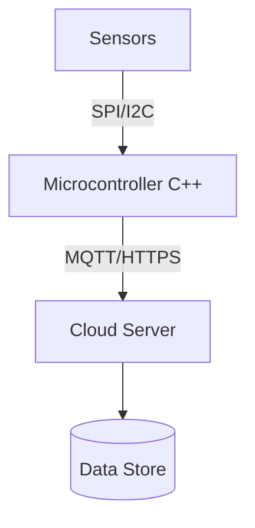

# Project Case Study: Clean Energy Automated Smart Irrigation System

- **Status:** Completed Prototype
- **Target Audience:** Sustainable agricultural farms
- **Tech Stack:** Embedded C++, Node.js, Hardware Telemetry Sensors
- **Live Demo Link:** [Pending Deployment]
- **Repository Link:** [https://github.com/akashgamerz6575-spec/smart-irrigation](https://github.com/akashgamerz6575-spec/smart-irrigation)

---

## 1. Executive Summary

### Problem Statement
Agricultural fields experience over-irrigation or under-irrigation due to lack of real-time moisture feedback loops, wasting water and crop yield.

### Motivation
To design a low-power hardware sensor network querying soil telemetry metrics to a cloud-based server to automate water distribution based on empirical data.

---

## 2. System Architecture

For full documentation details, copy [templates/project.md](file:///c:/Users/ManjuMJ/Documents/BEE/templates/project.md).
