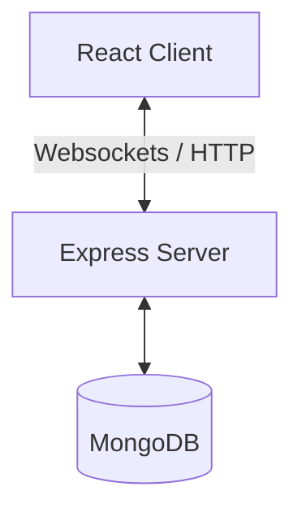

# Project Case Study: Real-time Maintenance Management System

- **Status:** Active Development
- **Target Audience:** Commercial facilities engineers
- **Tech Stack:** React, Node.js, Express, MongoDB
- **Live Demo Link:** [Pending Deployment]
- **Repository Link:** [https://github.com/akashgamerz6575-spec/maintenance-app](https://github.com/akashgamerz6575-spec/maintenance-app)

---

## 1. Executive Summary

### Problem Statement
Facilities lack real-time visibility into machine failures, leading to delayed communications, high maintenance response times, and machine downtime.

### Motivation
To build a highly responsive client-server dashboard utilizing web-sockets to broadcast incident statuses instantly to multiple administrative terminals.

---

## 2. System Architecture

For full documentation details, copy [templates/project.md](file:///c:/Users/ManjuMJ/Documents/BEE/templates/project.md).
