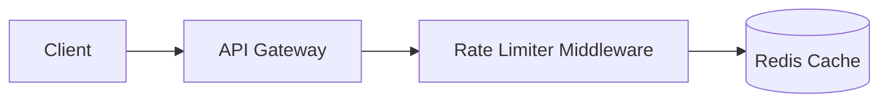

# System Design: Distributed Rate Limiter

- **Target SLA:** $< 5\text{ms}$ response latency.
- **Scale:** $100\text{k}$ requests per second.

## Architecture

## Decisions & Tradeoffs
- **Redis vs Memory:** Selected Redis to share rate limit tokens across distributed nodes, trading network latency for cluster parity.
