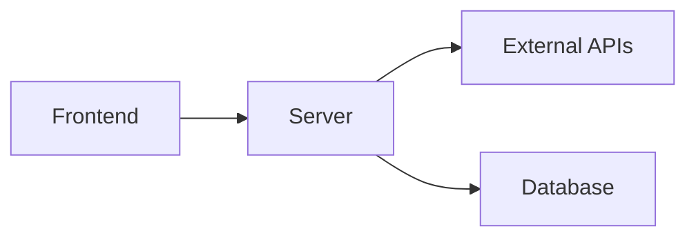

# Hackathon Log: [Hackathon Name]

- **Date:** [YYYY-MM-DD]
- **Organizer:** [Organizer Name]
- **Team Size:** [Number]
- **Role:** [Your Role - e.g., Backend Developer]
- **Project Repository:** [Link]

---

## 1. Project Overview

### Problem Addressed
What issue did the hackathon track target?

### Solution Proposed
Summary of the project built in 24/48 hours.

---

## 2. Technical Implementation

### Tech Stack Selected
List languages, databases, APIs, and frameworks used, and why they were chosen under tight deadlines.

### High-Level Architecture

---

## 3. Outcomes & Retrospective

### Results
- [Winner / Runner-up / Finalist / Participant]

### Key Code/Engineering Challenges
- Describe the biggest technical bottleneck solved during the hackathon.

### Wrong Assumptions & Lessons
- What assumptions failed during high-pressure building? How did you pivot?

### Future Action items
- Post-hackathon refinements to clean up prototype code.
