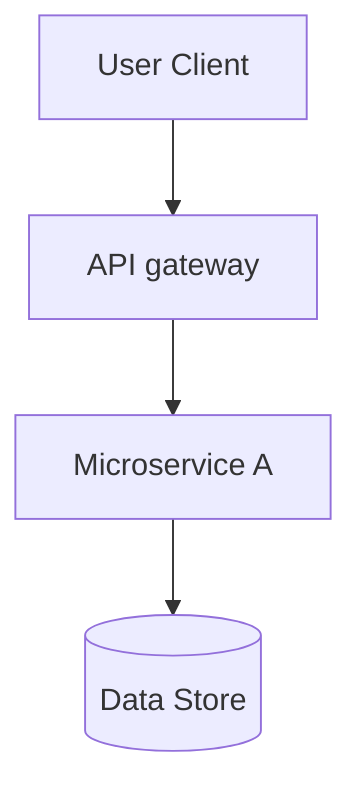

# Internship Retrospective: [Company Name]

- **Role:** [e.g., Software Engineering Intern]
- **Duration:** [Start Month YYYY - End Month YYYY]
- **Team:** [Team Name]
- **Tech Stack:** [Languages, Databases, Infrastructure tools]
- **Manager/Mentor:** [Name]

---

## 1. Project Specifications

### Business Objective
Explain what business goal the team targeted and how your project aligned with it.

### System Architecture
Detailed description of the services, databases, and message queues you worked on.

---

## 2. Technical Contributions

### Feature Deliverables
- **Feature 1:** High-level details, complexity, and testing coverage.
- **Feature 2:** High-level details, complexity, and testing coverage.

### Key Code Optimizations
- Quantitative metrics on latency reductions, memory footprints, or test coverage improvements.

---

## 3. Retrospective & Professional Growth

### Key Engineering Lessons
- What production-level practices were learned (e.g., telemetry, CI/CD pipelines, code reviews)?

### Mistakes & Root Cause Analysis
- Describe any production bugs, code review failures, or architectural missteps.
- Include the exact wrong assumptions and preventative actions developed.

### Future Goals
- What next-step skills should be pursued based on this professional feedback?
