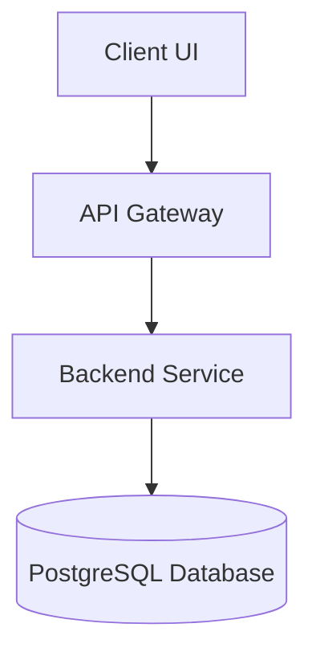

# Project Case Study: [Project Name]

- **Status:** [Active / Completed / Maintenance]
- **Target Audience:** [Internal / Production / Academic]
- **Tech Stack:** React, Node.js, Express, PostgreSQL, Docker, AWS
- **Live Demo Link:** [Link]
- **Repository Link:** [Link]

---

## 1. Executive Summary

### Problem Statement
A concise, formal statement of the core problem this project aims to solve.

### Motivation
Why is this project being built? What are the key educational or practical goals?

---

## 2. Requirements Specification

### Functional Requirements
- **FR1:** Description of core feature.
- **FR2:** Description of core feature.

### Non-Functional Requirements
- **NFR1:** Performance guarantees (e.g., latency $< 200\text{ms}$).
- **NFR2:** Scalability or security parameters.

---

## 3. System Architecture & Design

### Architectural Diagram
Suggest a clean Mermaid diagram representing component relationships.



### Folder Structure
```
.
├── src/
│   ├── config/
│   ├── controllers/
│   ├── models/
│   ├── routes/
│   └── index.js
├── Dockerfile
└── package.json
```

---

## 4. Database & API Design

### Database Design
Entity Relationship Diagram (ERD) or table schemas:

```sql
CREATE TABLE users (
    id SERIAL PRIMARY KEY,
    email VARCHAR(255) UNIQUE NOT NULL,
    created_at TIMESTAMP DEFAULT CURRENT_TIMESTAMP
);
```

### API Design
| Method | Endpoint | Description | Request Payload | Response Code |
| :--- | :--- | :--- | :--- | :--- |
| `GET` | `/api/v1/resource` | Fetch resource list | None | `200 OK` |
| `POST` | `/api/v1/resource` | Create new resource | `{ "key": "value" }` | `201 Created` |

---

## 5. Implementation Challenges & Lessons

### Technical Challenges
1. **Challenge Description:**
   - **Root Cause:**
   - **Resolution:**

### Lessons Learned
- Focus on architectural decisions and trade-offs made during development.

---

## 6. Performance, Deployment & Future Scope

### Performance Benchmarks
- Detail request latencies, load testing data, or optimization outcomes.

### Deployment Process
- How the codebase is containerized and deployed to staging or production.

### Future Scope
- Features planned for subsequent iterations.
